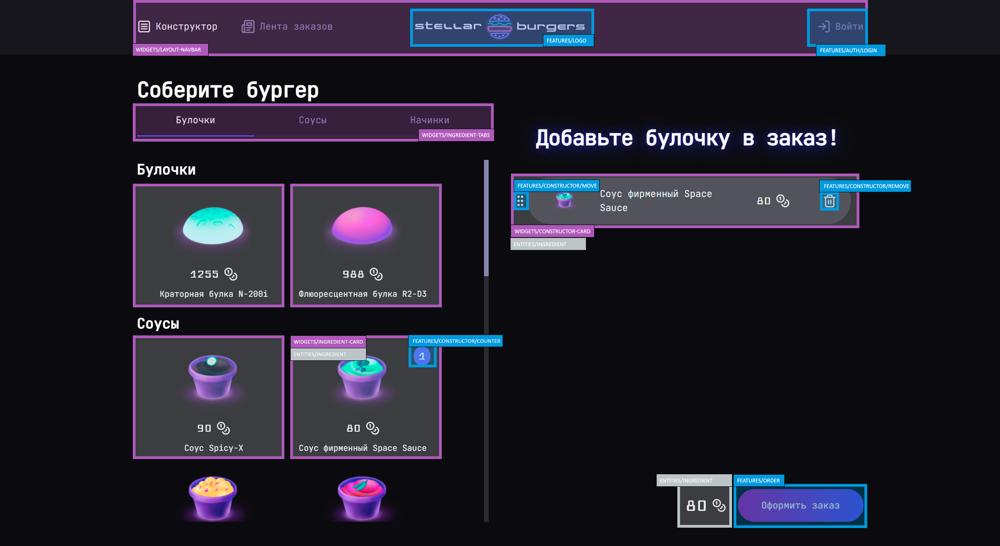

# Project: Stellar Burgers
[](#)
[](#)
[](#)
[](#)

:heavy_exclamation_mark:[Русская версия](./README.md)

## Description
«Stellar Burgers» is a web application with adaptive design, the final project of the course **«React-developer»** from Yandex Practicum. The application includes a large number of functions, several key user scenarios, and complex logic. Since Practicum does not pay attention to the issues of code architecture and provides a ready-made UI library, I tried to organize the code in accordance with the [Feature Sliced Design](https://feature-sliced.design/docs/get-started/overview ) 🍰 architectural methodology. I completely rewrote the UI library using TailwindCSS, as well. In addition, Vite is used instead of Create React App, which is recommended by Practicum. There are some other differences, both in the stack and in the approaches. They will be described below and represented in the code.

## Live Demo

Look live demo here: [Github Pages](https://gyolkin.github.io/stellar-burgers).

Or start the application locally. Follow steps below:
```
git clone https://github.com/gyolkin/stellar-burgers.git
cd react-burger
npm i
npm run dev
```
The application will start. A link will appear in the console.

## Tech Stack
- React 18
- Redux Toolkit (& RTK Query)
- React Router DOM v6.3.0
- React DND
- TailwindCSS

## A Few Words About FSD
There are no «hard» violations of the FSD methodology in the project — for comfortable work and future project support, a special FSD plugin for ESLint is also used. Some «soft» violations, mainly concerning the decomposition or the logic of the *lib* segment usage, were most often committed consciously, based on the specific needs of this project.

## TODO List
The application is fully working. Nevertheless, I'm planning to add/change a few things in the nearest future.

- [ ] Redux Persist: saving constructor state in localStorage
- [ ] Validation of forms
- [ ] Function testing (utils/helpers/etc)
- [ ] Component testing
- [ ] FSD: untie the modal window with information about created order from features/order.
- [ ] FSD: create widgets for modal windows